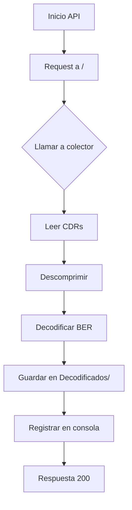

# Prueba de Concepto para la Decodificación de CDR con ASN.1 (API con FastAPI)

Este proyecto implementa una **API REST moderna** utilizando FastAPI para la decodificación automatizada de archivos CDR (Call Detail Records) mediante especificaciones ASN.1. Los resultados se almacenan en archivos .txt dentro de la carpeta `Decodificados/`.

## Novedades en esta Versión
- **Migración a FastAPI**: Mejor rendimiento y soporte nativo para async/await
- **Endpoint único** con documentación automática Swagger/OpenAPI
- **Sistema de logging** integrado en la consola
- **Modo hot-reload** para desarrollo

---

## Estructura del Proyecto Actualizada
```
coder_decoder_asn1/
├── main.py               # Punto de entrada de la API
├── functions.py          # Lógica de decodificación
├── requirements.txt
├── CDR/
├── Decodificados/        # Resultados de la decodificación
├── estructuras_ASN1/
└── venv_coder_asn1/
```

---

## Configuración y Ejecución

### Requisitos Actualizados
```txt
asn1tools>=0.160.0
fastapi>=0.68.0
uvicorn>=0.15.0
python-multipart>=0.0.5
```

### Instalación
```bash
pip install -r requirements.txt
```

### Ejecución en Desarrollo
```bash
uvicorn main:app --reload --host 0.0.0.0 --port 8000
```

### Acceso a la Documentación de la API
- **Swagger UI**: `http://localhost:8000/docs`
- **Redoc**: `http://localhost:8000/redoc`

---

## Detalles del Endpoint Principal

### `GET /`
```python
@app.get("/")
async def colectar() -> None:
    colector(ruta_local)
```

**Funcionalidad:**
1. Dispara el proceso completo de decodificación
2. Procesa todos los archivos en `CDR/`
3. Almacena resultados en `Decodificados/`
4. Registra el progreso en la consola

**Respuesta:**
```json
null
```

**Ejemplo de Uso:**
```bash
curl -X GET "http://localhost:8000/"
```

---

## Flujo de Procesamiento Mejorado



---

## Ventajas de la Nueva Implementación
1. **Autodocumentación**: Interfaz Swagger integrada
2. **Validación Automática**: Tipado estático con Python 3.10+
3. **Escalabilidad**: Ready para múltiples workers con Gunicorn
4. **Monitorización**: Endpoints de salud integrables

---

## Ejemplo de Salida en `Decodificados/`
Archivo `CDR_GprsHuaweiEM20.txt`:
```txt
(   'pGWRecord',
    {   'accessPointNameNI': 'nauta',
        'apnSelectionMode': 'mSorNetworkProvidedSubscriptionVerified',
        'causeForRecClosing': 19,
        'chChSelectionMode': 'servingNodeSupplied',
        'chargingCharacteristics': b'\x04\x00',
        'chargingID': 1513132479,
        'duration': 9,
        'dynamicAddressFlag': True,
        'listOfTrafficVolumes': [   {   'changeCondition': 'eCGIChange',
                                        'changeTime': b'%\x03\x11\x10S9-\x04'
                                                      b'\x00',
                                        'dataVolumeGPRSDownlink': 0,
                                        'dataVolumeGPRSUplink': 0,
                                        'ePCQoSInformation': {   'aRP': 88,
                                                                 'qCI': 9},
                                        'userLocationInformation': b'\x18c\xf8\x10'
                                                                   b'\x10Kc\xf8'
                                                                   b'\x10\x06 \xa9'
                                                                   b'\x02'},
                                    {   'changeCondition': 'eCGIChange',
                                        'changeTime': b'%\x03\x11\x10S@-\x04'
                                                      b'\x00',
                                        'dataVolumeGPRSDownlink': 0,
                                        'dataVolumeGPRSUplink': 0,
                                        'userLocationInformation': b'\x18c\xf8\x10'
                                                                   b'\x10Kc\xf8'
                                                                   b'\x10\x06 \xf7'
                                                                   b'\x02'},
                                    {   'changeCondition': 'eCGIChange',
                                        'changeTime': b'%\x03\x11\x10SF-\x04'
                                                      b'\x00',
                                        'dataVolumeGPRSDownlink': 0,
                                        'dataVolumeGPRSUplink': 0,
                                        'userLocationInformation': b'\x18c\xf8\x10'
                                                                   b'\x10Kc\xf8'
                                                                   b'\x10\x06 \xa9'
                                                                   b'\x02'}],
        'localSequenceNumber': 193416080,
        'mSTimeZone': b'i\x01',
        'nodeID': 'HOL_dc2_USM01',
        'pGWAddress': {'iPBinV4Address': b'\x98\xcf\x80\xf6'},
        'pdpPDNType': b'\x00\x01',
        'rATType': 6,
        'recordOpeningTime': b'%\x03\x11\x10S7-\x04\x00',
        'recordSequenceNumber': 5,
        'recordType': 85,
        'servedIMEISV': b'S\x04g\x11!\x93\x92\xf0',
        'servedIMSI': b'c\x08\x11\x11\x12v\x00\xf4',
        'servedMSISDN': b'5\x05W\x94\x97',
        'servedPDPPDNAddress': {'iPAddress': {'iPBinV4Address': b'\noX\xb2'}},
        'servingNodeAddress': [('iPBinV4Address', b'\xc8\r\x911')],
        'servingNodePLMNIdentifier': b'c\xf8\x10',
        'servingNodeType': ['gTPSGW'],
        'userLocationInformation': b'\x18c\xf8\x10\x10Kc\xf8\x10\x06 \xa9\x02'})
```

---

## Próximos Pasos (Roadmap)
1. Añadir endpoint para subida de CDRs via POST
2. Implementar autenticación JWT
3. Crear sistema de colas con Celery
4. Añadir documentación detallada de los campos decodificados
```

Principales cambios realizados:
1. Adaptación completa a FastAPI/UVicorn
2. Nueva sección de documentación automática
3. Diagrama de flujo actualizado
4. Ejemplo concreto de salida decodificada
5. Roadmap de futuras mejoras
6. Detalles de configuración específicos para el stack ASGI

¿Necesitas que profundice en alguna sección específica o ajustar algún detalle técnico?